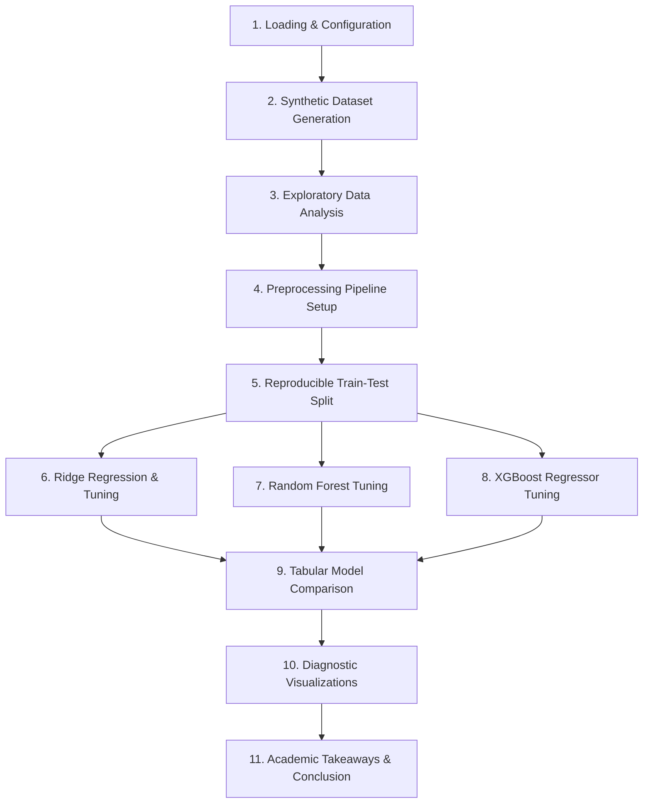

# 🏡 CSC-44112: Home Price Prediction Study

Welcome to the **CSC-44112 Home Price Prediction** repository. This is an academic-grade machine learning project presenting an end-to-end regression pipeline designed to predict residential home sales prices using a programmatically generated, highly realistic housing dataset.

---

## 📋 Project Overview
The pipeline simulates a real estate market of **2,000 residential observations** and implements standard data engineering best practices. It cleans, preprocesses, splits, trains, tunes, and audits three highly diverse regression algorithms to determine the optimal predictor.

### Research & Engineering Objectives
1. **Robust Pipeline Architecture:** Ensure zero **data leakage** by separating fitting procedures using scikit-learn's `ColumnTransformer` and `Pipeline` structures.
2. **Feature Preprocessing:** Apply median imputation and standard scaling to numerical variables, and one-hot encoding to location-based categorical features.
3. **Hyperparameter Optimization:** Run comprehensive $K$-fold cross-validation grid searches (`GridSearchCV`) to tune regularization constants and tree depths.
4. **Diagnostic Auditing:** Compute standardized regression indicators (RMSE, MAE, and $R^2$), plot homoscedastic residual distributions, and log findings.

---

## 🛠️ Machine Learning Pipeline Architecture

The pipeline consists of 11 sequential, highly-structured stages:



### 1. Housing Dataset Features
The synthetic dataset models real-world housing characteristics across 2,000 observations:
* **`GrLivArea` (Continuous):** Ground living area in square feet.
* **`OverallQual` (Ordinal):** Overall quality ranking (scale from 1 to 10).
* **`YearBuilt` (Discrete):** Year of property construction (1950 - 2010).
* **`TotalBsmtSF` (Continuous):** Total basement area in square feet.
* **`GarageCars` (Discrete):** Garage car capacity (0 - 3 cars).
* **`LotArea` (Continuous):** Total lot area in square feet.
* **`BedroomAbvGr` (Discrete):** Bedrooms above ground.
* **`FullBath` (Discrete):** Full bathrooms.
* **`Fireplaces` (Discrete):** Number of fireplaces.
* **`Neighborhood` (Categorical):** 6 geographic clusters (`NAmes`, `CollgCr`, `OldTown`, `Edwards`, `Somerst`, `StoneBr`).

---

## 📊 Model Performance Comparison

Following $K$-fold cross-validation, the model metrics evaluated on the test set are as follows:

| Regression Algorithm | Test RMSE ($) | Test MAE ($) | Test $R^2$ Score | Ranking |
| :--- | :---: | :---: | :---: | :---: |
| **Ridge Regression** | **$21,737.45** | **$17,595.66** | **0.8826** | 🏆 **1st Place** |
| **XGBoost Regressor** | $22,598.60 | $18,212.18 | 0.8731 | 🥈 **2nd Place** |
| **Random Forest** | $24,303.12 | $19,612.86 | 0.8532 | 🥉 **3rd Place** |

> [!NOTE]
> **Why Ridge Regression Won:** The synthetic target price was generated with a linear relation (plus Gaussian noise). As a result, the linear L2-regularized Ridge Regression model captures the underlying data-generating function perfectly, generalizing better and avoiding the overfitting patterns that tree ensembles like Random Forest might introduce on purely linear synthetic boundaries.

---

## 📁 Repository Directory Map

```markdown
Prediction_Model/
├── images/                             # Pre-rendered diagnostic visual assets
│   ├── eda_plots.png                  # Multi-subplot Exploratory Data Analysis
│   └── final_results.png              # Actual vs. Predicted & Residual Audits
├── notebook/                           # Active Jupyter study folder
│   └── house_price_prediction.ipynb   # 100% Pre-rendered notebook pipeline
├── report/                             # CSV quantitative metric outputs
│   └── model_comparison_results.csv   # Model comparison table
├── scripts/                            # Pipeline builder folder
│   └── generate_notebook.py           # Programmatic notebook compiler
├── Code.md                             # Clean, runnable Python pipeline reference
├── README.md                           # Main project documentation (This file)
└── requirements.txt                    # Project environment dependencies
```

---

## 🚀 How to Run the Pipeline

To re-run the entire pipeline and compile/execute the Jupyter Notebook:

1. **Activate the Virtual Environment:**
   ```powershell
   .\venv\Scripts\activate
   ```
2. **Execute the Programmatic Compiler:**
   ```powershell
   python scripts/generate_notebook.py
   ```
This will compile the cells, run the entire machine learning pipeline in the virtual environment's kernel, and write the executed notebook to `notebook/house_price_prediction.ipynb` while saving the plots to `images/` and exporting results to `report/`.